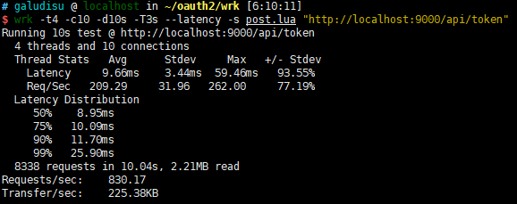

Akka based oauth2 
=================


>1. if you need sharding region，modify each service Associate code with `forwardCommandWithoutSharding` to `forwardCommand`.
>2. until now both token and code with ttl 5 minutes.

Read this in other languages：[English](README.md), [简体中文](README.zh-cn.md)

## Usage

You need to add your user to the `docker` group.

```bash
sudo gpasswd -a ${USER} docker
```

package to jar file using `sbt-native-package` plugin, and wrote this docker images.

```bash
sbt packageBin
sbt docker
```

publish your image to container,

```bash
sudo docker run -p 9000:9000 --name comic -it -d io.comiccloud/comic-cloud-oauth2
```

## Benchmark

the statistics of the wrk show as belong, which only test on my laptop(cassandra and oauth2 placed in the same vmware)



## Create Account

```
put localhost:9000/api/account
{
	"username": "galudisu",
	"password": "$ea(oo2!f",
	"salt": "ejOpaakl108",
	"email": "galudisu@gmail.com"
}
```

## Apply a client

1. Account Id，will verify the owner
2. Client Id，need to be a developer(doesn't check yet)
3. Client Id，need to has roles(doesn't check yet)
4. redirect uri

This component(or service) will not check the password or any other form fields.

```
put localhost:9000/api/client
{
    "account_id": "b19b28ae-6af5-4603-b588-02be213e2262",
    "redirect_uri": "http://localhost:3000/callback"
}
```

## Apply a Code

1. Account Id
2. Client Id
3. The Redirect Uri, this is use for authorization_code mode.

```
put localhost:9000/api/code
{
    "account_id": "b19b28ae-6af5-4603-b588-02be213e2262",
    "client_id": "8a70c2923877f4caf6ab45538457c5d628e6bce0"
}
```

## Produce token

1. Generate by appid and appkey, `client_credentials` mode

```
post localhost:9000/api/token
{
    "appid": "8a70c2923877f4caf6ab45538457c5d628e6bce0",
    "appkey": "3aa585d12085692348199b5227727bbc2c42a395",
    "grant_type": "client_credentials"
}
```

2. `authorization_code` mode, the code will be consume and it has a shorten tll.

```
post localhost:9000/api/token
{
    "appid": "8a70c2923877f4caf6ab45538457c5d628e6bce0",
    "appkey": "3aa585d12085692348199b5227727bbc2c42a395",
    "redirect_uri": "http://baidu.com",
    "code": "9afle",
    "grant_type": "authorization_code"
}
```

3. `password` mode, or sometimes call `form` mode,

```
post localhost:9000/api/token
{
    "appid": "d9c28170-be68-11e9-b4e3-d3b42412204e",
    "appkey": "d9c28171-be68-11e9-b4e3-d3b42412204e",
    "username": "galudisu",
    "password": "$ea(oo2!f",
    "grant_type": "password"
}
```

4. Refresh token

```
post localhost:9000/api/token
{
    "appid": "d9c28170-be68-11e9-b4e3-d3b42412204e",
    "appkey": "d9c28171-be68-11e9-b4e3-d3b42412204e",
    "refresh_token": "665cad90-be7d-11e9-ae62-d350c56ae498",
    "grant_type": "refresh_token"
}
```

## The resource entrance

```bash
curl --dump-header -H "Authorization: Bearer ${access_token}" http://localhost:9000/api/resources
```